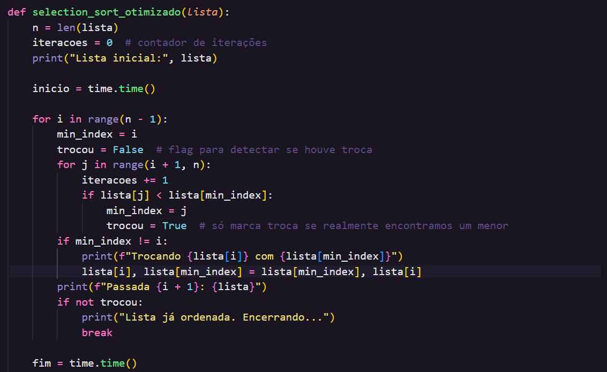
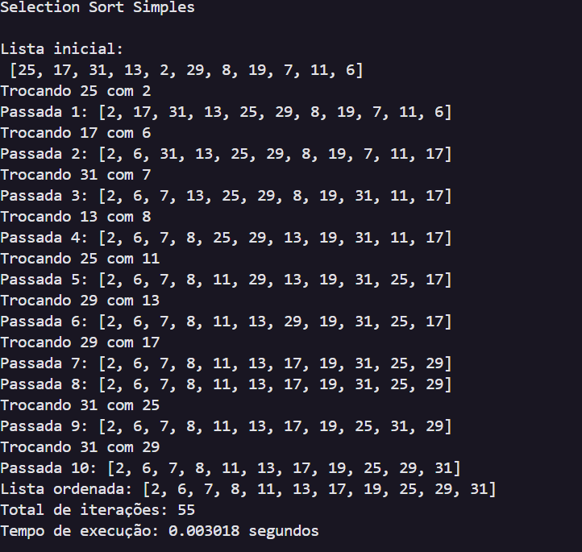
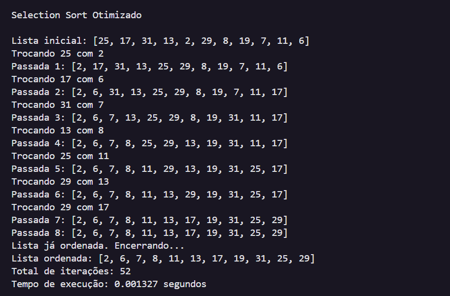
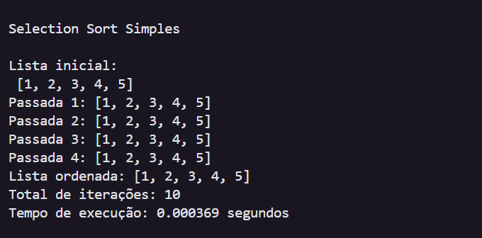
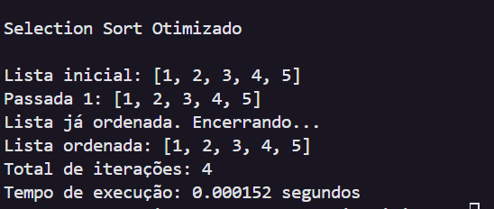

# 🟦 Otimização do Selection Sort em Python

Implementação do algoritmo Selection Sort otimizado em Python.

## 📌 Descrição

O Selection Sort é um algoritmo de ordenação que organiza uma lista selecionando o menor elemento da sublista não ordenada e colocando-o na posição correta.

A versão Otimizada do Selection Sort evita trocas desnecessárias: só realiza a troca se o menor elemento encontrado não estiver na posição correta.

## ⚡ Funcionamento da otimização

Para cada posição i da lista:

Procura o menor elemento da sublista não ordenada.
 Mantém o índice do menor elemento (min_index).
 Após percorrer a sublista, verifica se a troca é necessária:
 Se min_index != i → troca os elementos.
 Caso contrário → não faz nada.
 
 Essa simples verificação evita trocas inúteis, economizando operações, especialmente quando a lista já está parcialmente ordenada.

📊 Variável total_iteracoes

A variável total_iteracoes conta quantas comparações o algoritmo realizou ao buscar o menor elemento.

Cada vez que o loop interno compara lista[j] < lista[min_index], é uma iteração.
Contar as iterações ajuda a analisar a eficiência do algoritmo: menos comparações indicam melhor desempenho em listas quase ordenadas.

## 🚀 Testes

### Teste 1 Selection Simples:
* Tempo de execução: 0.003018 segundos
* Total de iterações: 55

### Teste 1 Selection Otimizado:
* Tempo de execução: 0.001327 segundos
* Total de iterações: 52

### Teste 2 Selection Simples:
* Tempo de execução: 0.000369 segundos
* Total de iterações: 10

### Teste 2 Selection Otimizado:
* Tempo de execução: 0.000152 segundos
* Total de iterações: 4 

## 🔹 Vantagens do Selection Sort Otimizado

Evita trocas desnecessárias → reduz operações, principalmente em listas quase ordenadas.

Mantém lógica simples e in-place → não usa memória extra significativa.

Facilita análise de desempenho → com contagem de iterações, é fácil estudar eficiência.

## 🔹 Conclusão e Explicação

O Selection Sort Simples sempre troca o menor elemento com a posição atual, mesmo que já esteja correto, resultando em operações desnecessárias.

O Selection Sort Otimizado:

Verifica se a troca é realmente necessária.

Evita movimentações inúteis, economizando tempo e processamento.

É especialmente útil em listas parcialmente ordenadas, embora a complexidade no pior caso continue sendo O(n²).
